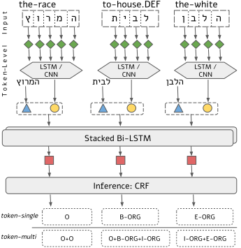
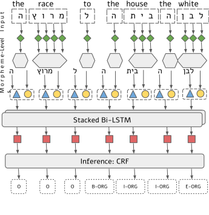
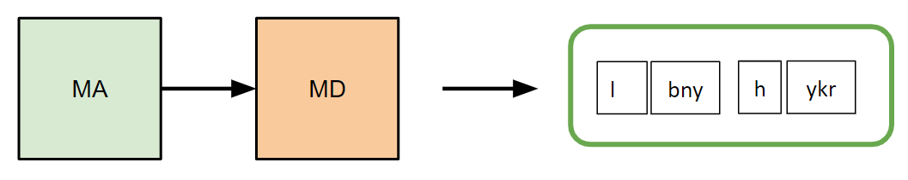
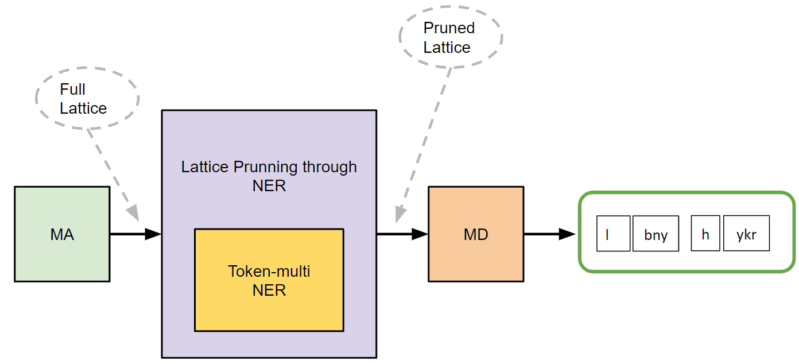
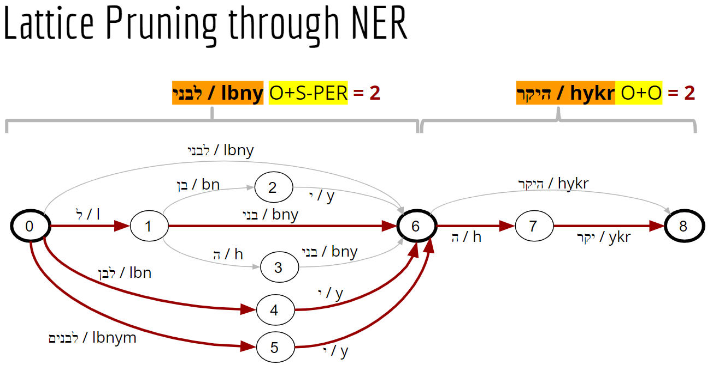
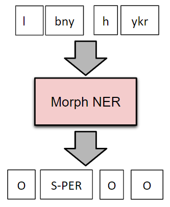
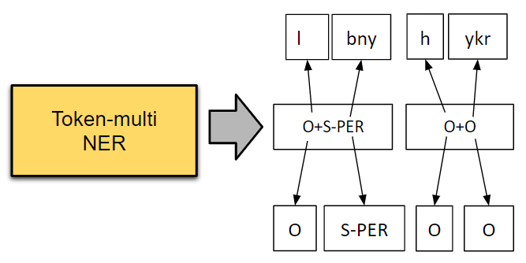
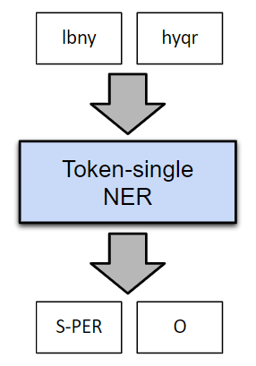
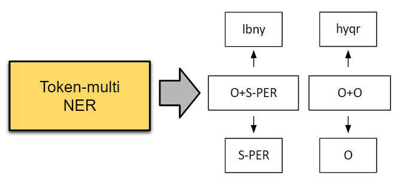
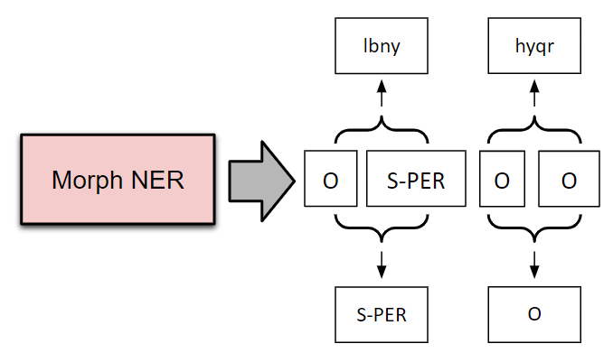

# 🐠<sup>🐠</sup> NEMO<sup>2</sup> - Neural Modeling for (Hebrew) Named Entities and Morphology
## Introduction
Code and models for neural modeling of Hebrew NER. Described in the TACL paper [""*Neural Modeling for Named Entities and Morphology (NEMO<sup>2</sup>)"*](https://arxiv.org/abs/2007.15620) along with extensive experiments on the different modeling scenarios provided in this repository.

## Main Features
1. Trained on the [NEMO corpus](https://github.com/OnlpLab/NEMO-Corpus) of gold annotated Modern Hebrew news articles. 
1. Multiple modeling options to go from raw Hebrew text to morpheme and/or token-level NER boundaries.
1. Neural model implementation of [NCRFpp](https://github.com/jiesutd/NCRFpp)
1. [bclm](https://github.com/OnlpLab/bclm) is used for reading and transforming morpho-syntactic information layers.


## Requirements
1. `python>=3.6`
1. `torch=1.0`
1. `networkx`
1. `yap`: https://github.com/OnlpLab/yap (don't forget `export GOPATH=</path/to/yapproj>`)
1. `bclm>=1.0.0`: http://github.com/OnlpLab/bclm 


## Setup
1. Install all requirements, preferably in a virtual env.
1. Clone the repo.
1. Change to the repo directory: `cd NEMO`
1. Unpack model files: `gunzip data/*.gz`
1. Change `YAP_PATH` in `config.py` to the path of your local `yap` executable.


## Basic Usage
1. All you need to do is run `nemo.py` with specific command (scenario), with a text file of Hebrew sentences separated by a linebreak as input.
1. We provide direct run of the neural NER models, as well as full end-to-end scenarios that include morphological segmentation and alignments (described fully in the [next section](#models-and-scenarios)). e.g.:
    * the `run_ner_model` command with the `token-single` model will tokenize sentences and run the `token-single` model: 
        - ```python nemo.py run_ner_model token-single example.txt example_output.txt```
    * the `morph_hybrid` command runs the end-to-end segmentation and NER pipeline which provided our best performing morpheme-level NER boundaries:  
        - ```python nemo.py morph_yap morph example.txt example_output_MORPH.txt```
1. For a full list of the available commands please consult the [next section](#models-and-scenarios) and the inline documentation at the end of `nemo.py`. 
1. Please use only the regular and not the `*_oov` models (which contain embeddings only for words that appear in the NEMO corpus). Unless you use the model to replicate our results on the Hebrew treebank, always use e.g. `token-multi` and not `token-multi_oov`. 


## Models and Scenarios
Models are all standard Bi-LSTM-CRF with char encoding (LSTM/CNN) of [NCRFpp](https://github.com/jiesutd/NCRFpp) with pre-trained fastText embeddings. Differences between models lay in:
1. **Input units**: morphemes `morph` vs. tokens `token-*`
1. **Output label set**: `token-single` single sequence labels  (e.g. `B-ORG`) vs. `token-multi` multi-labels (atomic labels, e.g. `O-ORG^B-ORG^I-ORG`) that predict, in order, the labels for the morphemes the token is made of.

Token-based Models         |  Morpheme-based Model
:-------------------------:|:---------------------:
  |   

Morphemes must be predicted. This is done by performing morphological disambiguation (*MD*). We offer two options to do so: 
1. **Standard pipeline**: MD using YAP. This is used in the `morph_yap` command, which runs our `morph` NER model on the output of YAP joint segmentation.
1. **Hybrid pipeline**: MD using our best performing *Hybrid* approach, which uses the output of the `token-multi` model to reduce the MD option space. This is used in `morph_hybrid`, `multi_align_hybrid` and `morph_hybrid_align_tokens`. We will explain these scenarios next.

|MD Approach        |  Commands |
|                --:|:---------------------:|
| Standard  |  `morph_yap`
| Hybrid  <br>  | `morph_hybrid`,<br>`multi_align_hybrid`,<br>`morph_hybrid_align_tokens`|

Finally, to get our desired output (tokens/morphemes), we can choose between different scenarios, some involving extra post-processing alignments:
1. To get morpheme-level labels we have two options:
    * Run our `morph` NER model on predicted morphemes: Commands: `morph_yap` or `morph_hybrid` (better). 
    * `token-multi` labels can be aligned with predicted morphemes to get morpheme-level boundaries. Command: `multi_align_hybrid`.
    
|Run `morph` NER on Predicted Morphemes        |  Multi Predictions Aligned with Predicted Morpheme  |
| :--:|:---------------------:
| |   |
|`morph_yap`,`morph_hybrid` | `multi_align_hybrid` |

2. To get token-level labels we have three options:
    *  `run_ner_model` command with `token-single` model.
    * `token-multi` labels can be mapped to `token-single` labels to get standard token-lingle output. Command: `multi_to_single`.
    * Morpheme-level output can be aligned back to token-level boundaries. Command: `morph_hybrid_align_tokens` (achieved best token-level results in our experiments). 
    
| Run `token-single`        |  Map `token-multi` to `token-single` | Align `morph` NER with Tokens  | 
|:--:|:---------------------:|:---:|
| |   |  |
|`run_ner_model token-single` | `multi_to_single` | `morph_hybrid_align_tokens` |

* Note: while the `morph_hybrid*` scenarios offer the best performance, they are less efficient since they requires running both `morph` and `token-multi` NER models.


## Important Notes
1. NCRFpp was great for our experiments on the NEMO corpus (which is given, constant, data), but it holds some caveats for real life scenarios of arbitrary text:
    * fastText is not used on the fly to obtain vectors for OOV words (which were not seen in our Wikipedia corpus). Instead, it is used as a regular embedding matrix. In our experiments we created such a matrix in advance with all the words of our, and used during training. Hence the full generalization capacities of fastText, as shown in our experiments, are not available in the currently provided models, which will perform slightly worse than they could on arbitrary text. Information regarding training your own model with your own vocabulary in the [next section](#training-your-own-model).
    * We currently do not provide an API, only file input/outputs. The pipeline works in the background through temp files, you can choose to delete these by default using the `DELETE_TEMP_FILES` config parameter.  
1. In the near future we plan to publish a cleaner end-to-end implementation, including use of our new [AlephBERT](https://github.com/OnlpLab/AlephBERT) pre-trained Transformer models. 
1. For archiving and reproducibility purposes, our original code used for experiments and analysis can be found in the following repos: https://github.com/cjer/NCRFpp, https://github.com/cjer/NER (beware - 2 years of Jupyter notebooks).


## Training your own model


## Citations

If you use the NEMO<sup>2</sup> code or the NEMO corpus, please cite the NEMO<sup>2</sup> paper:
```bibtex
@article{DBLP:journals/corr/abs-2007-15620,
  author    = {Dan Bareket and
               Reut Tsarfaty},
  title     = {Neural Modeling for Named Entities and Morphology (NEMO{\^{}}2)},
  journal   = {CoRR},
  volume    = {abs/2007.15620},
  year      = {2020},
  url       = {https://arxiv.org/abs/2007.15620},
  archivePrefix = {arXiv},
  eprint    = {2007.15620},
  timestamp = {Mon, 03 Aug 2020 14:32:13 +0200},
  biburl    = {https://dblp.org/rec/journals/corr/abs-2007-15620.bib},
  bibsource = {dblp computer science bibliography, https://dblp.org}
}
```

If you use the NEMO<sup>2</sup>'s NER models please also cite NCRF++:
```bibtex
@inproceedings{yang2018ncrf,  
 title={{NCRF}++: An Open-source Neural Sequence Labeling Toolkit},  
 author={Yang, Jie and Zhang, Yue},  
 booktitle={Proceedings of the 56th Annual Meeting of the Association for Computational Linguistics},
 Url = {http://aclweb.org/anthology/P18-4013},
 year={2018}  
}
 ```